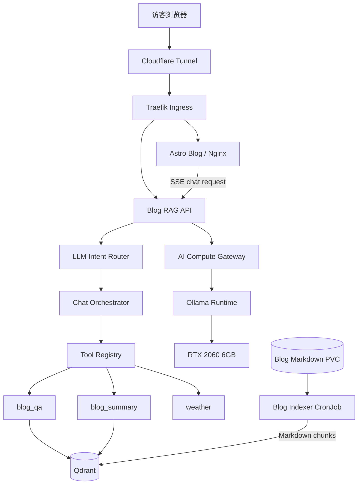
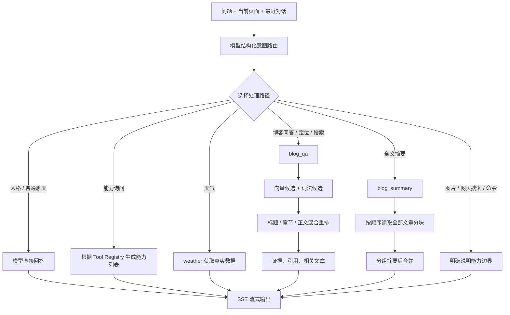

这个项目最初的目标很简单：**给博客加一个聊天框，让访客可以直接询问文章内容。**

真正做下去以后，我才发现“能聊天”和“能可靠地回答博客问题”是两件完全不同的事。

一个模型可以很自然地讲笑话、解释概念，也可以一本正经地编造博客中不存在的内容；一次向量检索可以找到语义相近的段落，却未必能准确回答“这句话在哪一节”；一个功能丰富的工具系统看起来很强，但工具越多，路由错误和维护成本也越高。

这篇文章记录的不是一个从一开始就设计完美的系统，而是一条更真实的路线：从简单 RAG 出发，逐步加入意图识别、会话上下文、技能、工具、网页搜索和多模态，然后重新审视目标，最后把系统收敛成一个更专注、更可靠的博客助手。

如果只看最终结果，很多取舍显得理所当然。可真正有价值的，往往是中间那些“为什么做”“为什么不工作”“为什么最后删掉”的过程。

## 最终想解决什么问题

在动手之前，我给这个助手设定了几个比较具体的目标：

1. 普通聊天应该自然，不要每个问题都硬套博客内容。
2. 涉及博客事实时，回答必须能追溯到原文。
3. 用户正在阅读某篇文章时，助手要知道“当前文章”是哪一篇。
4. “这部分说了什么”和“这部分在哪里”是两类问题，回答方式不能相同。
5. 摘要必须读取全文，不能拿搜索到的三个片段假装总结整篇文章。
6. 引用要简洁、可点击，并准确跳到对应章节。
7. 在一台普通家用服务器上运行，资源要够用，但不能铺张浪费。

这些目标共同指向一个结论：它不应该只是“接了向量数据库的聊天接口”，而应该是一套有明确边界的站点助手。

## 最终架构

项目被拆成三个独立仓库，每个仓库有自己的职责和自动构建流程：

- `blog`：Astro 静态博客、聊天界面、K3s 部署清单。
- `blog-rag-api`：意图路由、会话编排、博客检索、工具执行和引用生成。
- `ai-compute-gateway`：统一封装 OpenAI 兼容接口，隔离底层 Ollama 和模型细节。

运行环境是单节点 K3s。公网流量通过 Cloudflare Tunnel 进入 Traefik，再由 Ingress 分发到博客和 RAG API。只有模型运行时申请 GPU，其他服务都按普通 CPU 工作负载运行。



这层拆分带来一个很实际的好处：模型运行、站点业务和前端发布可以独立变化。替换模型不需要改博客；重构检索不需要碰 Gateway；修改页面也不会触发 Maven 依赖下载。

## 一次问题是怎么被回答的

用户发送问题时，前端会附带当前页面上下文，包括页面类型、文章 `slug`、标题、URL 和当前章节。RAG API 不会立刻查询 Qdrant，而是先让模型输出严格 JSON，只负责判断意图，不负责回答问题。



最终的意图大致分为以下几类：

- `DIRECT_PERSONA`：问候、身份和助手人格。
- `CAPABILITY`：询问当前启用的能力。
- `DIRECT_GENERAL`：普通聊天、技术问答、翻译、润色和计算。
- `BLOG_CURRENT_QA`：针对当前文章提问。
- `BLOG_SITE_QA`：基于全站文章回答问题。
- `BLOG_LOCATE`：定位文章或章节。
- `BLOG_SEARCH`：查找站内是否写过某个主题。
- `BLOG_RECOMMEND`：推荐相关文章。
- `BLOG_SUMMARY`：总结当前或指定文章全文。
- `WEATHER`：查询实时天气。
- `UNSUPPORTED`：当前明确不支持的能力。

这里最重要的不是意图名称，而是**每种意图拥有不同的证据范围和回答契约**。

## 博客问答为什么不能只靠向量搜索

最早的实现非常直接：把问题做 Embedding，去 Qdrant 找相似度最高的几个片段，然后交给模型回答。

这种方法回答“RSA 为什么安全”通常还不错，但遇到下面的问题就容易出错：

- “RSA 名称由来在哪一节？”
- “这篇文章的混合加密部分说了什么？”
- “博客里有没有写过非对称加密？”

原因是向量相似度更擅长找“意思相近”，不一定擅长找精确标题、人名、缩写、公式和章节名称。尤其中文短问题的信息量很少，一个语义相关但位置错误的段落很容易排在前面。

最终的检索流程改成了混合检索：

1. 用 Embedding 从 Qdrant 获取语义候选。
2. 按当前 `slug` 或全站范围读取词法候选。
3. 对标题、章节、正文和标签分别计算匹配分。
4. 中文使用二元、三元片段，英文保留缩写、数字和命令词项。
5. 合并候选后统一重排，再执行证据阈值判断。

完整章节名和文章标题会获得更高权重，因此“名称由来在哪一节”可以稳定命中“为什么需要 RSA？”，而不是只找到包含 RSA 公式的相似段落。

这也让我重新认识了 RAG：**Embedding 不是搜索的终点，只是召回的一种手段。** 对结构化文章来说，标题层级、页面范围和词法特征同样重要。

## 当前文章是怎么被识别的

聊天组件不会保存长期聊天记录，但一次会话中仍保留有限的短期上下文。更关键的是，每次请求都会携带当前页面信息。

当用户在 `/rsa/` 页面提问“这一节为什么这么做”时，后端收到的不只是这一句话，还会收到可信的页面元数据。路由器据此选择 `BLOG_CURRENT_QA`，编排器则强制把工具参数收敛为：

```json
{
  "task": "ANSWER",
  "scope": "CURRENT_POST",
  "slug": "rsa"
}
```

当前文章范围不是交给模型自由发挥的。模型负责理解用户想做什么，程序负责执行不能违反的范围约束。

这条边界很重要。否则模型偶尔漏掉 `scope`，一次“这篇文章”的提问就可能退化成全站搜索，返回看似正确、实际来自其他文章的内容。

## 全文摘要和普通 RAG 是两套流程

摘要曾经复用普通问答检索，但很快暴露了问题：Top K 检索只会返回少量相关片段，无法代表全文。生成的内容语句通顺，却可能完全漏掉文章后半部分。

因此 `blog_summary` 不再做向量检索，而是：

1. 解析当前文章或用户指定的文章。
2. 按文章顺序读取该 `slug` 的全部分块。
3. 去掉相邻分块的重叠内容。
4. 按长度分组，分别生成忠实的局部摘要。
5. 将局部摘要合并为最终的结构化摘要。

这是一种简单的分层摘要。它比直接把全文塞进上下文慢一些，但边界清晰：问答使用相关证据，摘要使用完整正文。

## 引用不只是“显示一个数字”

引用功能经历了不少小问题：

- 模型输出了不存在的 `[3]`，但实际只有两个来源。
- 角标能跳到文章，却定位到了错误章节。
- 模型既在正文里输出角标，又在末尾手写一遍裸 URL。
- 流式输出结束后，清洗后的答案没有覆盖前端已经收到的草稿。

最终的处理方式是：

1. 引用由工具结果生成，模型不能凭空创造来源。
2. 后端过滤超出引用数量的角标。
3. 引用 URL 使用真实章节 anchor。
4. 前端点击角标时执行站内软跳转，聊天组件不会销毁。
5. 页面内定位会结合引用片段，在章节下继续寻找最接近的段落。
6. SSE 完成时，前端用后端清洗后的最终答案重新渲染气泡。

看起来只是一个小角标，背后其实同时涉及检索、数据结构、流式协议、前端路由和 DOM 定位。

## 软件版本是怎么一步步变化的

这里不按每个提交逐条罗列，而是把迭代归纳为六个阶段。

### V0：静态博客

最初只有 Astro 静态站点，由 Nginx 提供内容，K3s 负责部署，Cloudflare Tunnel 负责公网入口。这个阶段的重点是把博客本身稳定地跑起来。

### V1：简单 RAG 问答

第一版聊天功能包含 Markdown 索引、Embedding、Qdrant 检索和模型回答。它证明了“博客可以被问答”，但所有问题几乎都会进入 RAG：问“你是谁”也可能返回博客片段。

### V2：意图、技能与工具系统

系统加入编排层、会话上下文、意图识别、技能注册表和 OpenAI 兼容工具调用。天气、计算、编码转换、笑话等能力被拆成独立技能。

这一阶段架构更完整，但也出现了新问题：为了证明工具系统足够灵活，加入了太多本可以由模型直接完成的小工具。固定笑话不如模型自然，简单计算和文本处理也没有必要全部包装成公开站点工具。

### V3：聊天体验和引用修复

前端逐步加入左右气泡、不同颜色、KaTeX 数学公式、SSE 流式输出、站内软跳转和精确引用定位。这个阶段让我意识到，模型回答正确只完成了一半，用户最终感知到的是整个交互链路。

### V4：多模态和网页研究试验

系统曾接入视觉模型、图片上传、SearXNG、网页读取和连续搜索，希望助手能识图、搜索新闻并继续研究。

功能确实变多了，但代价也很明显：

- 6GB 显存下视觉模型占用更高，文本响应速度下降。
- 图片格式、尺寸和上下文长度引入了更多失败路径。
- 网页搜索结果质量不稳定，还要处理超时、重定向和安全边界。
- 意图路由更容易把普通问题送进错误工具。
- 博客助手的核心价值反而被稀释。

### V5：主动收敛为站点助手

最终版本删除了图片识别和公共网页搜索，公开工具只保留：

- `blog_qa`
- `blog_summary`
- `weather`

笑话、翻译、润色、计算和普通技术问题交还给大模型直接回答。博客事实仍必须经过工具和证据。聊天模型切换为 Q4_K_M 量化的 Qwen3 4B Instruct 纯文本模型，在当前硬件上兼顾速度、显存和回答质量。

这次收敛不是功能倒退，而是重新回答了一个问题：**这个产品究竟最应该擅长什么？**

## 模型和资源的取舍

服务器使用 i5-10400F、约 15GB 内存和 RTX 2060 6GB。这个配置可以运行 4B 量化模型，但没有太多挥霍空间。

最终选择是：

- 聊天模型：Qwen3 4B Instruct，Q4_K_M 量化。
- Embedding：`bge-m3`，1024 维。
- 模型运行时：Ollama。
- 聊天模型和 Embedding 模型按 Keep Alive 保留一段时间，不强制永久常驻。
- 只有模型 Runtime 申请 GPU。

线上回归时，聊天模型和 Embedding 模型都能使用 GPU，总显存占用约 3.86GB；RAG API 和计算网关的内存各在约 150MB 左右。

“尽可能全部交给 GPU”并不等于 CPU 和内存不该变化。分词、JSON、HTTP、向量结果处理、Java 对象和模型调度仍然会消耗 CPU 与内存。更合理的目标是让矩阵计算落在 GPU，同时让其他资源保持可预测，而不是追求监控图上的 CPU 永远不动。

## 自动构建和部署

三个仓库使用各自的自托管 GitHub Actions Runner，彼此独立触发：

- 博客代码变化时，Astro 构建并发布到 K3s PVC，同时同步 Markdown 给索引器。
- RAG API 变化时，执行 Maven 测试和打包。
- Gateway 变化时，只构建 Gateway。

依赖安装也做了最小化处理：`package-lock.json` 没变时复用 `node_modules`，`pom.xml` 没变时优先使用 Maven 离线缓存。这样普通代码提交不会反复下载同一批依赖。

镜像使用不可变时间标签，而不是 `latest`。这点在 K3s 本地 containerd 环境尤其重要：`IfNotPresent + latest` 很容易让 CronJob 继续使用节点上的旧镜像，看起来已经发布，实际运行的还是上一版。

## 这次项目里最值得记住的经验

### 1. 先定义产品边界，再设计工具数量

工具系统的价值不在“有多少工具”，而在“哪些动作必须被程序可靠执行”。天气需要真实外部数据，博客问答需要证据范围，全文摘要需要完整文章；笑话和润色则更适合交给模型。

### 2. 意图可以交给模型，约束必须留在代码里

模型擅长理解“用户想做什么”，但不应该决定所有安全边界。当前文章的 `slug`、公开工具白名单、最大工具循环次数、引用数量和不支持能力，都需要程序兜底。

### 3. RAG 的核心是证据治理，不是向量数据库

真正影响答案质量的是：索引怎么切、范围怎么限定、标题怎么加权、证据不足时是否拒绝、引用能否回到原文。Qdrant 只是其中一个组件。

### 4. 全文任务和检索任务不要混用

问答需要最相关片段，摘要需要完整有序正文。两者复用同一条 Top K 流程，看似省代码，实际上会制造非常隐蔽的内容缺失。

### 5. 流式输出必须有“最终状态”

流式 delta 是草稿，最终答案才是经过引用过滤和格式清洗的结果。协议中应该显式返回最终内容，让前端在 `done` 时校准，而不是假设所有 delta 拼起来一定等于最终展示。

### 6. 小模型更需要结构化约束

4B 模型完全可以承担路由和回答，但提示词必须明确、输出格式必须可验证、失败时必须有保守降级。能力列表尤其不应该让模型自由发挥，而应从 Registry 动态生成。

### 7. 删除功能也是一次重要迭代

多模态和网页搜索并非做不到，而是在当前硬件、站点定位和维护成本下不值得。删除它们后，显存更从容，路由更准确，核心博客问答也有更多精力打磨。

## 最后的总结

这个项目最终形成了一条相对清晰的原则：

> 普通问题让模型自然回答，站点事实让工具提供证据，程序负责守住边界。

从技术上看，它包含 Astro、Spring Boot、Ollama、Qdrant、SSE、Traefik、Cloudflare Tunnel 和 K3s；但这些组件并不是项目最难的部分。

真正困难的是不断判断：哪里应该相信模型，哪里必须依赖数据，哪里需要强约束，哪里应该承认当前做不到。

现在的小站助手功能比试验阶段少了，却更接近最初真正想要的东西：它能自然聊天，也知道什么时候必须回到文章；它能告诉你答案，也能把你带回答案所在的位置；它不会因为“看起来更智能”就假装拥有尚未启用的能力。

对一个个人博客来说，这种克制可能比功能列表更重要。
