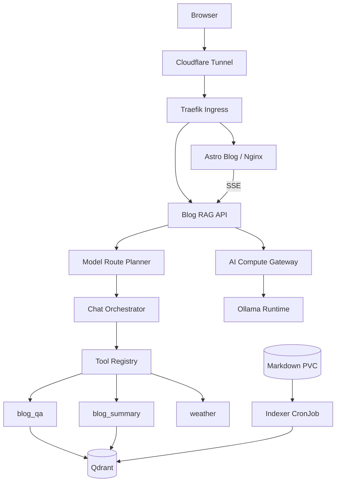
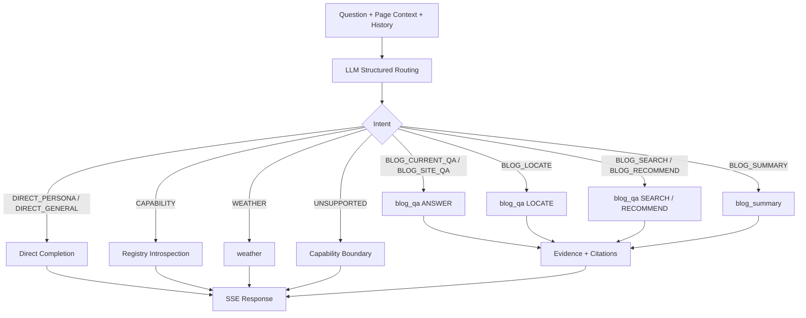
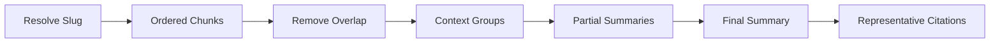

这套系统的目标，是为静态博客增加一个能够理解页面上下文、检索站内内容并提供原文引用的智能问答入口。

它并不是简单地把聊天接口接到向量数据库。普通聊天、当前文章问答、站内搜索、章节定位和全文摘要，对上下文范围、检索方式和输出格式都有不同要求。系统因此采用了“模型理解意图，程序执行约束，工具提供证据”的分层设计。

本文主要介绍最终架构、核心请求链路、RAG 实现和几个重要的工程取舍。

## 系统目标

系统需要满足以下要求：

1. 普通聊天不触发博客检索。
2. 博客事实必须基于索引证据回答。
3. 能识别用户当前正在阅读的文章和章节。
4. 支持当前文章问答、全站问答、站内搜索、章节定位和文章推荐。
5. 全文摘要必须读取完整、有序的文章内容。
6. 引用可点击，并能定位到对应章节或正文片段。
7. 支持 SSE 流式输出，同时保留最终答案校正能力。

## 技术栈

系统分为三个独立项目：

| 项目 | 技术 | 职责 |
| :--- | :--- | :--- |
| `blog` | Astro、TypeScript、Nginx | 静态页面、聊天组件、Markdown 内容和部署清单 |
| `blog-service` | Spring Boot、Java、SQLite | 意图路由、会话编排、工具执行、检索、引用和限流 |
| `ai-compute-gateway` | Spring Boot、OpenAI 兼容协议 | 统一封装聊天、Embedding、流式响应和工具调用 |

基础设施包括：

- **Qdrant**：保存文章分块和向量。
- **Ollama**：运行聊天模型和 Embedding 模型。
- **K3s**：编排 Web、API、模型网关、模型运行时、Qdrant 和索引任务。
- **Traefik**：集群入口和路由。
- **Cloudflare Tunnel**：将公网流量引入 Traefik。
- **GitHub Actions Runner**：执行三个仓库各自的构建和发布任务。

## 整体架构



业务 API 与模型运行时之间增加了一层计算网关。这样做有三个作用：

- RAG API 不直接依赖 Ollama 的私有接口。
- 模型名称、超时、Keep Alive 和备用模型集中配置。
- 聊天、Embedding、SSE 和 OpenAI 工具调用使用统一协议。

## 请求处理流程

前端发送问题时，会附带当前页面上下文：

```json
{
  "question": "这一节为什么这样设计？",
  "sessionId": "...",
  "pageContext": {
    "pageType": "BLOG_POST",
    "slug": "rsa",
    "title": "RSA 加密原理",
    "url": "/rsa/",
    "heading": "为什么需要 RSA？"
  }
}
```

后端先调用路由模型。路由模型只输出严格 JSON，不直接回答用户问题。编排器再根据路由结果决定直接回答或调用工具。



当前核心路由包括：

- `DIRECT_PERSONA`：身份、问候和助手人格。
- `CAPABILITY`：查询当前启用能力。
- `DIRECT_GENERAL`：普通聊天和通用文本任务。
- `BLOG_CURRENT_QA`：限定当前文章回答。
- `BLOG_SITE_QA`：基于全站博客回答。
- `BLOG_LOCATE`：定位文章章节。
- `BLOG_SEARCH`：查询站内是否存在相关内容。
- `BLOG_RECOMMEND`：推荐相关文章。
- `BLOG_SUMMARY`：生成当前或指定文章的全文摘要。
- `WEATHER`：查询实时天气。
- `UNSUPPORTED`：未启用或不允许的能力。

## 模型路由与程序约束

意图识别由模型完成，但关键约束由程序补全。

例如用户在文章页面询问“这一节说了什么”，模型只需要识别为 `BLOG_CURRENT_QA`。`ModelRoutePlanner` 会强制设置：

```json
{
  "task": "ANSWER",
  "scope": "CURRENT_POST"
}
```

当前文章的 `slug` 来自页面上下文，不允许模型自行猜测。这可以避免模型遗漏参数后，把当前文章问题错误地扩大为全站检索。

同样，公开工具不是全部暴露给模型：

- 已明确路由的请求只执行对应工具。
- 只有 `UNKNOWN` 才允许模型在白名单内进行原生工具选择。
- 工具循环有最大次数限制。
- 未启用的图片识别、网页搜索和服务器操作直接进入 `UNSUPPORTED`。

能力查询也不由模型自由生成，而是根据 `ToolRegistry` 的实时注册结果组成答案，避免模型虚构系统能力。

## 博客索引

`blog-indexer` 以 CronJob 方式运行，读取同步到 PVC 的 Markdown 文件。

索引流程包括：

1. 解析 frontmatter、标题层级、正文和标签。
2. 按章节和长度切分文章。
3. 为分块保留 `slug`、标题、章节、URL、顺序等元数据。
4. 调用计算网关生成 Embedding。
5. 将向量和 payload 写入 Qdrant。
6. 使用 SQLite 保存文件状态，只处理新增或发生变化的文章。

文章顺序元数据非常重要。普通检索不关心分块先后，但全文摘要必须能够恢复原文顺序。

## 混合检索与重排

第一版 RAG 只使用向量相似度。它适合回答语义问题，却不擅长处理精确标题、人名、缩写和章节定位。

最终的 `BlogRetriever` 同时使用两类候选：

1. **向量候选**：通过 Embedding 找到语义相关片段。
2. **词法候选**：从当前文章或全站分块中计算标题、章节、正文和标签匹配。

词法处理保留英文缩写、数字和命令词项，中文使用二元与三元片段。随后 `BlogReranker` 合并候选并重新评分：

- 完整章节匹配具有较高权重。
- 完整标题匹配优先于弱向量相似。
- 正文词项和向量分作为补充信号。
- 当前文章问题先按 `slug` 限定检索范围。

这种方式能同时覆盖两类问题：

- “为什么 RSA 不直接加密大段数据？”依赖语义检索。
- “RSA 名称由来在哪一节？”依赖章节和精确词项匹配。

重排后的真实分数会继续用于证据阈值判断。如果最高分仍不足，系统应返回证据不足，而不是让模型补写博客中不存在的内容。

## `blog_qa` 工具

博客问答、定位、搜索和推荐共用 `blog_qa`，通过 `task` 区分输出契约：

| task | 行为 |
| :--- | :--- |
| `ANSWER` | 基于检索证据回答问题 |
| `LOCATE` | 优先说明文章和章节位置，并提供少量原文 |
| `SEARCH` | 先回答站内是否存在，再列出匹配文章 |
| `RECOMMEND` | 按文章去重并说明推荐理由 |

工具返回的不只是文本，还包括：

- `citations`
- `relatedPosts`
- `ragTopScore`
- `scope`
- `slug`
- `task`

这些结构化字段由编排器合并到最终响应，前端不需要从模型文本中反向解析引用。

## 全文摘要

全文摘要不能复用 Top K 检索。少量相关片段无法代表完整文章。

`blog_summary` 的流程是：

1. 根据当前页面或用户指定标题解析文章 `slug`。
2. 从 Qdrant 读取该文章的全部分块。
3. 按顺序排列，并去除相邻分块的重叠内容。
4. 按上下文长度分组生成局部摘要。
5. 合并局部摘要，生成最终结构化摘要。



工具元数据会记录 `chunkCount` 和 `summaryLevels`，便于确认摘要确实读取了完整文章，而不是退化为普通检索。

## 引用与页面定位

引用由 `CitationBuilder` 根据检索分块生成，包含文章标题、章节、URL 和摘要片段。

后端会执行以下清理：

- 删除超出实际来源数量的角标。
- 删除模型重复生成的“角标 + 裸 URL”来源行。
- 对重复 URL 和章节引用去重。

前端把 `[1]` 渲染为上标链接。站内引用不会直接刷新整个页面，而是：

1. Fetch 目标页面 HTML。
2. 替换页面主体，保留聊天组件和当前对话。
3. 根据 URL anchor 定位章节。
4. 使用 citation snippet 在章节内进一步匹配正文节点。
5. 滚动并高亮最终位置。

因此，引用定位不只依赖章节 ID。即使一个章节包含多个长段落，也可以继续定位到更接近证据的位置。

## SSE 流式协议

`POST /api/chat/stream` 使用 SSE 返回以下事件：

```text
meta
delta
delta
...
citations
relatedPosts
done
```

- `meta`：路由、模式和已调用工具。
- `delta`：模型增量文本。
- `citations`：最终结构化引用。
- `relatedPosts`：相关文章。
- `done`：耗时和清洗后的最终答案。

`done.answer` 是必要的。流式 delta 是模型原始草稿，最终答案还需要经过引用过滤和格式清理。前端在收到 `done` 后重新渲染最终文本，从而兼顾实时反馈和最终一致性。

## 会话上下文

聊天记录不持久化到浏览器或数据库，但服务端会为当前 `sessionId` 保留有限的短期历史，用于理解省略指代。

会话上下文只参与路由和回答，不覆盖当前页面范围。路由提示中明确要求：历史对话只能用于还原省略信息，不能把新问题强行套入上一轮意图。

## 部署结构

K3s 中主要划分为两个命名空间：

- `blog`：`blog-web`、`blog-service`、`blog-indexer`。
- `ai`：`ai-compute-gateway`、`ai-compute-runtime`、`qdrant`。

只有模型运行时需要访问加速设备；RAG API、网关、Qdrant 和索引器都是普通工作负载。

模型运行时和业务服务分离后，可以独立更新 RAG 代码、模型配置和前端页面。Cloudflare Tunnel 作为独立 Deployment 运行，不依附于博客 Pod，单个业务 Pod 重启不会中断整个公网入口。

## CI/CD

三个仓库各自使用独立的自托管 GitHub Actions Runner：

- `blog`：构建 Astro，发布 `dist` 到 PVC，同步 Markdown，并触发索引任务。
- `blog-service`：执行 Maven 测试和打包。
- `ai-compute-gateway`：单独构建计算网关。

依赖缓存按清单文件哈希控制：

- `package.json` 和 `package-lock.json` 未变化时跳过 `npm ci`。
- `pom.xml` 未变化时优先使用 Maven 离线缓存。

容器镜像使用不可变版本标签，不使用 `latest`。在本地 containerd 与 `IfNotPresent` 组合下，不可变标签可以防止 Deployment 或 CronJob 意外复用旧镜像。

## 版本演进

系统的主要版本可以归纳为以下阶段：

### V1：基础 RAG

- Markdown 分块与 Embedding。
- Qdrant 向量检索。
- 模型基于 Top K 片段回答。

问题是缺少意图隔离，普通聊天也可能进入博客检索。

### V2：助手编排与工具系统

- 引入 `ChatOrchestrator`。
- 增加模型结构化路由。
- 增加 Tool Registry 和 OpenAI 工具调用。
- 加入短期会话上下文和能力查询。

### V3：引用与交互完善

- SSE 流式输出。
- 左右聊天气泡和 Markdown、KaTeX 渲染。
- 结构化引用、相关文章和站内软跳转。
- 基于 snippet 的精确正文定位。

### V4：能力扩展试验

- 尝试图片输入、多模态模型和网页研究。
- 增加外部搜索、网页读取和连续工具调用。

这些功能扩大了路由空间，也增加了超时、格式兼容和结果质量的不确定性。

### V5：聚焦博客场景

- 移除图片识别和公共网页搜索。
- 公开工具收敛为 `blog_qa`、`blog_summary` 和 `weather`。
- 普通文本任务交给模型直接回答。
- 加入混合检索、任务化回答契约和确定性能力说明。

最终版本减少了公开工具数量，但博客相关请求的范围控制和证据质量更明确。

## 工程经验

### 1. 模型负责语义，代码负责边界

模型适合判断用户意图，但当前文章范围、工具白名单、最大循环次数和引用数量必须由程序约束。

### 2. RAG 质量取决于检索之外的完整链路

文章切分、元数据、范围过滤、重排、证据阈值和引用定位，都会直接影响最终质量。向量数据库只是其中一环。

### 3. 不同任务需要不同数据访问模式

问答使用相关片段，摘要读取完整正文，定位问题提高章节匹配权重。把所有请求塞进同一个 Top K 流程，会产生稳定但难以察觉的错误。

### 4. 工具数量不是能力指标

只有需要真实数据、确定范围或可审计结果的动作，才值得成为工具。普通聊天和文本转换交给模型更简单。

### 5. 流式响应需要最终校正事件

模型增量输出可能包含无效角标或重复来源。SSE 协议应返回经过后端清洗的最终答案，前端再进行一次一致性渲染。

### 6. 可观测元数据应进入响应和日志

`intent`、`mode`、`usedTools`、`ragTopScore`、`scope` 和 `latencyMs` 能快速区分路由错误、检索问题和生成问题，比只查看最终文本更有效。

## 总结

这套博客智能问答系统最终形成了三层职责：

- **路由层**理解用户意图和页面上下文。
- **工具与检索层**提供受范围约束的真实证据。
- **生成层**根据证据组织自然语言答案。

普通问题由模型直接回答；博客事实通过 RAG 工具获取；当前文章、全文摘要、引用数量和能力边界由代码保证。

这一架构没有追求通用 Agent 的最大工具集合，而是围绕博客阅读、检索和理解建立明确的处理路径。对于站点型智能助手，稳定的范围控制和可追溯证据，通常比更多功能更重要。
